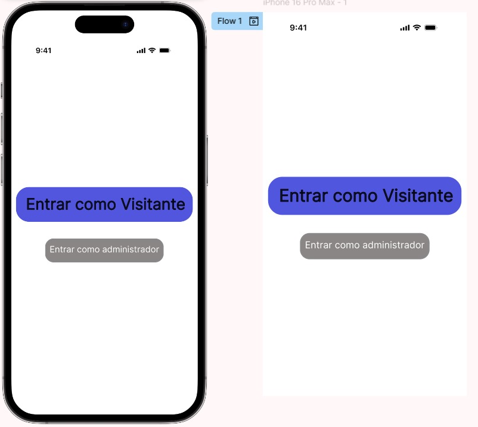
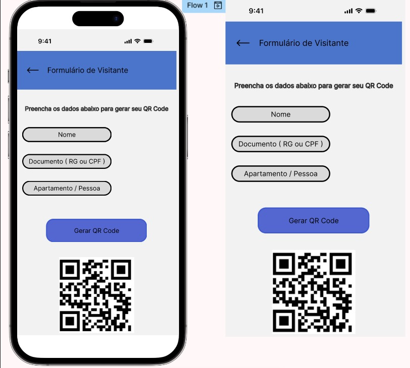
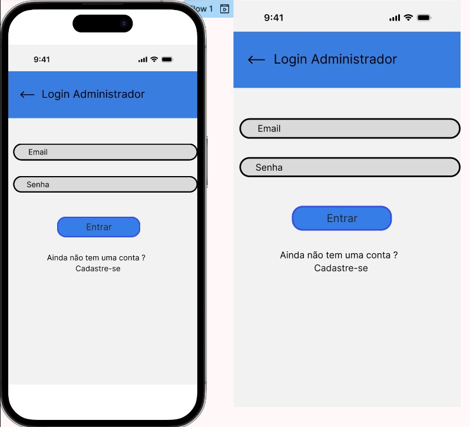
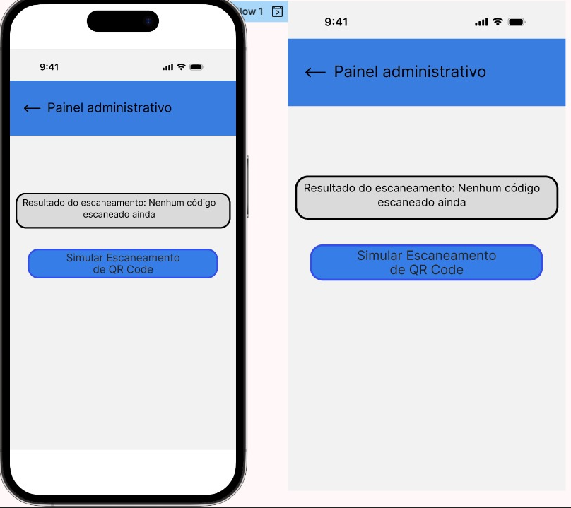
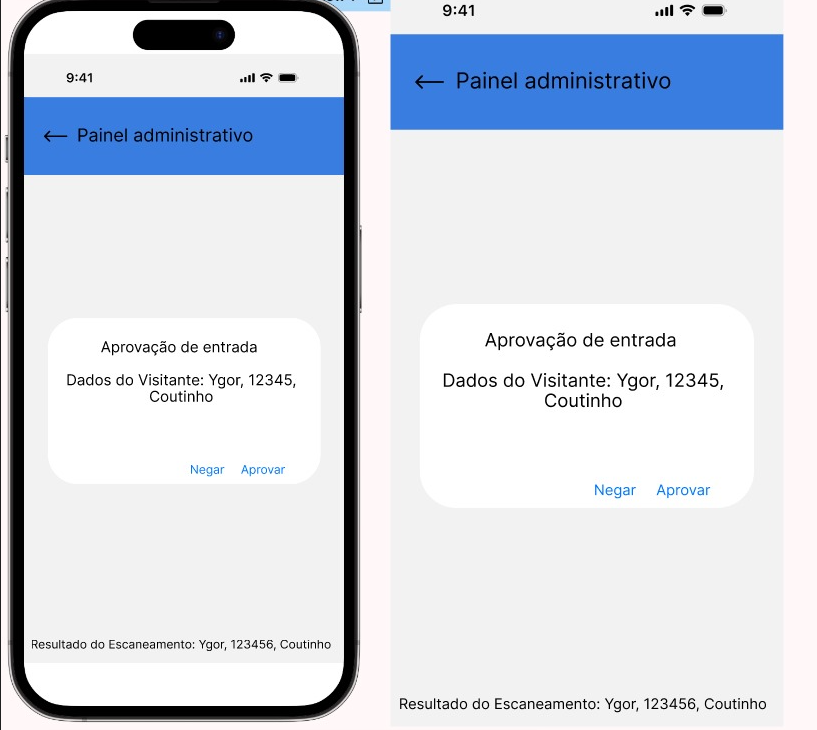

# Documentação do Projeto: App de Controle de Acesso para Visitantes com QR Code

## Descrição do Projeto

Este projeto é um aplicativo desenvolvido com **Flutter** que permite controlar o acesso de visitantes a um prédio ou local restrito. O visitante escaneia um **QR Code** gerado previamente, fornece suas informações pessoais e, se as informações forem validadas corretamente e a localização for confirmada, sua entrada é autorizada. O sistema também notifica o administrador sobre a entrada do visitante.

## Funcionalidades do Aplicativo

### **Arquivo `main.dart`**

- **Inicia o Firebase**: Configura o Firebase para que o app possa usar todos os recursos necessários, como o armazenamento de dados e a autenticação de visitantes.
- **Configura o aplicativo principal**: Define o ponto de entrada para o aplicativo, incluindo a navegação entre as telas.
- **Define as rotas de navegação**: Configura as rotas de navegação entre a tela de login (se necessário), a tela de cadastro do visitante e a página principal de controle de acesso.

### **Arquivo `visitor_login.dart`**

- **Tela de Login (Opcional)**: Caso haja um sistema de login para administradores ou outros usuários, esta tela permite que eles se autentiquem.
- **Redirecionamento para Tela Principal**: Após a autenticação, o usuário é direcionado à tela de controle de visitantes.

### **Arquivo `visitor_scan.dart`**

- **Escaneamento de QR Code**: Permite que o visitante escaneie um QR Code para iniciar o processo de entrada.
- **Solicitação de Dados Pessoais**: Após o escaneamento, o visitante insere seus dados pessoais, como nome e número do documento.
- **Validação de Dados**: Verifica se os dados fornecidos estão corretos e se o QR Code corresponde a um visitante válido.
- **Verificação de Localização**: Verifica a localização do visitante no momento da tentativa de entrada, garantindo que ele esteja no local correto.

### **Arquivo `firebase_options.dart`**

- **Configurações do Firebase**: Contém as configurações necessárias para inicializar o Firebase, permitindo o uso de Firestore para armazenar dados e Firebase Authentication para autenticação.
- **Suporte para Android e iOS**: Inclui ajustes específicos para o Firebase funcionar corretamente tanto em dispositivos Android quanto iOS.

### **Arquivo `home.dart`**

- **Notificações em Tempo Real**: Envia notificações para o administrador sobre a entrada de novos visitantes.
- **Exibição de Visitantes Autorizados**: Mostra informações em tempo real sobre visitantes que foram autorizados a entrar, incluindo nome, documento e horário de entrada.
- **Feedback Visual para Administradores**: Permite que o administrador veja em tempo real as informações dos visitantes e o status de suas entradas.

## Design da Aplicação

### **1. Material Design**

O aplicativo segue as diretrizes do **Material Design** para garantir uma interface visual consistente e fácil de usar. Elementos como barras de aplicativo, cards, botões e listas são usados para organizar a navegação de forma clara e intuitiva.

### **2. Layout Responsivo**

O layout é totalmente responsivo e se adapta a diferentes tamanhos de tela utilizando widgets como `Column`, `Expanded` e `ListView.builder`. Isso garante que o app funcione bem em dispositivos com diferentes resoluções de tela.

### **3. Cores e Estilo**

- **Paleta de Cores**: A paleta de cores é composta por tons de **verde** e **cinza** para transmitir uma sensação de segurança e confiabilidade, com verde destacando as ações de autorização e cinza sendo usado para o fundo.
- **Design Limpo e Moderno**: O design utiliza cores neutras e elementos gráficos modernos para garantir uma boa legibilidade e uma experiência de usuário agradável.

### **4. Feedback Visual**

O app inclui mensagens visuais e alertas em tempo real para o usuário, como notificações de entrada autorizada, erros na validação de dados ou falhas na localização. Essas mensagens ajudam a melhorar a interação e garantem que o visitante e o administrador saibam o status da entrada.

### **5. Elementos Interativos**

Botões interativos, como o de "Autorização de Entrada", e cards que mostram informações sobre os visitantes tornam a navegação mais dinâmica e fácil. O administrador pode tocar nas notificações ou listas de visitantes para obter mais detalhes.

### **6. Tipografia**

A tipografia é simples e clara, utilizando fontes fáceis de ler. Títulos em negrito e o uso de diferentes tamanhos de fonte ajudam a organizar as informações e facilitar a leitura.

## Integração com Firebase

A integração com o **Firebase** oferece várias vantagens, incluindo:

- **Firebase Authentication**: Para autenticação do visitante, garantindo que apenas visitantes registrados possam tentar acessar.
- **Firestore**: Para o armazenamento em tempo real dos dados dos visitantes (nome, documento, horário de entrada), permitindo que o administrador acesse essas informações rapidamente.
- **Firebase Cloud Messaging (FCM)**: Para enviar notificações em tempo real ao administrador sobre a entrada de visitantes.

O Firebase é escolhido pela sua facilidade de integração com o Flutter, sua escalabilidade e pelos recursos que ele oferece para autenticação e banco de dados na nuvem.

## Fluxo de Usuário

1. **Visitante escaneia o QR Code**: O visitante escaneia o QR Code gerado pelo administrador.
2. **Preenchimento dos Dados Pessoais**: O visitante fornece suas informações (nome, documento de identidade, etc.).
3. **Validação de Dados**: O aplicativo valida os dados fornecidos e verifica a localização do visitante.
4. **Notificação ao Administrador**: O administrador recebe uma notificação informando que o visitante foi autorizado a entrar, com todos os dados necessários.
5. **Entrada Autorizada**: O visitante pode então acessar o local restrito.

## Requisitos Técnicos

- **Plataforma de Desenvolvimento**: Flutter (com suporte para Android e iOS).
- **Banco de Dados**: Firebase Firestore.
- **Autenticação**: Firebase Authentication.
- **Geolocalização**: Utilização do pacote `geolocator` para verificar a localização do visitante.
- **Notificações**: Firebase Cloud Messaging (FCM) para notificações em tempo real.
- **Escaneamento de QR Code**: Pacote `qr_code_scanner` ou outro adequado.

## Cronograma do Projeto

### **Fase 1 - Levantamento de Requisitos e Design** (Data de início - Data de conclusão)
- Definir os fluxos de usuário e o design da interface.
- Escolher tecnologias e ferramentas necessárias.

### **Fase 2 - Desenvolvimento da Funcionalidade de QR Code e Autenticação** (Data de início - Data de conclusão)
- Implementar o escaneamento de QR Code.
- Integrar o Firebase para autenticação e armazenamento de dados.

### **Fase 3 - Implementação de Localização e Notificações** (Data de início - Data de conclusão)
- Implementar geolocalização para verificar a entrada do visitante.
- Configurar o envio de notificações em tempo real para o administrador.

### **Fase 4 - Testes e Ajustes** (Data de início - Data de conclusão)
- Realizar testes de usabilidade, segurança e performance.
- Ajustar funcionalidades e corrigir bugs.

### **Fase 5 - Lançamento e Monitoramento** (Data de início - Data de conclusão)
- Publicação nas lojas de aplicativos (Google Play Store, Apple App Store).
- Monitoramento e suporte contínuo.

## Riscos e Mitigações

- **Risco**: Falha na leitura do QR Code.
  - **Mitigação**: Implementação de uma interface de feedback para ajudar o visitante a posicionar corretamente o código.
  
- **Risco**: Problemas na verificação de localização.
  - **Mitigação**: Uso de uma API confiável de geolocalização, como Google Maps API, com verificações periódicas de precisão.

- **Risco**: Notificações em tempo real podem falhar.
  - **Mitigação**: Testes contínuos com Firebase Cloud Messaging para garantir que as notificações sejam enviadas corretamente.

- **FIGMA**
 - **HOME**
 ()

 - **FORMULÁRIO VISITANTE**
 

 - **LOGIN**
 

 - **PAINEL ADM**
 

 - **PAINEL ADM**
 

