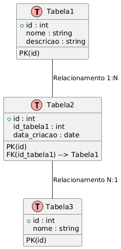

Objetivo
Este aplicativo é uma implementação simples de uma lista de tarefas utilizando o framework Flutter. A aplicação permite aos usuários adicionar tarefas, mover tarefas entre diferentes categorias ("A Fazer", "Fazendo" e "Feito"), marcar tarefas como concluídas e excluir tarefas. O gerenciamento do estado é feito usando a biblioteca Provider para garantir que a interface do usuário seja atualizada conforme as mudanças nos dados.

Estrutura Geral do Aplicativo
O aplicativo é dividido em diferentes componentes, incluindo a lógica de negócios (gestão de tarefas) e a interface do usuário. Abaixo está uma descrição do que cada parte do código realiza:

Função Principal (main)

A função main é o ponto de entrada do aplicativo. Ela chama a função runApp, que inicia o widget principal da aplicação, ListaTarefasApp. Este widget envolve a aplicação em um ChangeNotifierProvider, que é responsável por fornecer o modelo de dados (gerenciamento de tarefas) para a árvore de widgets.
Modelo de Dados (ListaTarefasModel)

A classe ListaTarefasModel é a parte central que gerencia o estado do aplicativo. Ela mantém três listas de tarefas: "A Fazer", "Fazendo" e "Feito". Essas listas são usadas para categorizar as tarefas conforme o status.
A classe é baseada em ChangeNotifier, que permite notificar a interface sempre que o estado mudar (por exemplo, quando uma tarefa é adicionada ou movida).
A classe oferece métodos para:
Adicionar uma tarefa: A tarefa é criada e adicionada à lista de tarefas "A Fazer".
Excluir uma tarefa: O método permite excluir uma tarefa de qualquer lista, com base no status da tarefa.
Mover uma tarefa entre colunas: Permite mover a tarefa entre "A Fazer" e "Fazendo". Não é permitido mover uma tarefa diretamente para a coluna "Feito", pois isso requer que a tarefa seja marcada como concluída.
Marcar uma tarefa como concluída: Quando uma tarefa é concluída (por meio de um checkbox na interface), ela é movida para a lista "Feito" e o status é alterado para "Feito".
Interface do Usuário (ListaTarefasScreen)

A classe ListaTarefasScreen define a interface do usuário e organiza os widgets que compõem a tela.
A tela é composta por um campo de texto para o usuário digitar a descrição de uma nova tarefa e um botão para adicioná-la à lista de tarefas.
O restante da tela é dividido em três seções, uma para cada status de tarefa: "A Fazer", "Fazendo" e "Feito". Cada seção é renderizada com a lista de tarefas correspondentes.
Para cada tarefa, a interface exibe:
Descrição da tarefa.
Status (se a tarefa está concluída ou não).
Botões de ação:
Um ícone de seta para mover a tarefa entre "A Fazer" e "Fazendo".
Um checkbox para marcar a tarefa como concluída, movendo-a para "Feito".
Um ícone de lixeira para excluir a tarefa.
O uso do Consumer permite que a interface se atualize automaticamente quando a lista de tarefas for alterada.
Gerenciamento de Estado com Provider

O Provider é uma ferramenta de gerenciamento de estado que permite que o estado (neste caso, o modelo de dados das tarefas) seja compartilhado entre diferentes partes da aplicação sem a necessidade de passar dados explicitamente entre widgets.
O ChangeNotifierProvider é responsável por fornecer a instância da classe ListaTarefasModel a todos os widgets que necessitam acessar ou modificar a lista de tarefas.
O Consumer é usado dentro da interface para escutar as mudanças no modelo e atualizar a tela sempre que o estado das tarefas mudar.
Funcionamento da Aplicação
Adicionar Tarefas

O usuário pode adicionar uma tarefa ao campo de texto e pressionar o ícone de adição. A tarefa será adicionada à lista "A Fazer" se a descrição não estiver vazia.
Mover Tarefas

As tarefas podem ser movidas entre as listas "A Fazer" e "Fazendo" utilizando os botões de seta. No entanto, não é possível mover tarefas diretamente para "Feito". Esse movimento só ocorre quando a tarefa é marcada como concluída.
Marcar Como Concluída

O usuário pode marcar uma tarefa como concluída clicando no checkbox ao lado da tarefa. Quando marcada, a tarefa é movida para a lista "Feito" e o status é atualizado para "Feito".
Excluir Tarefas

O usuário pode excluir uma tarefa de qualquer lista (A Fazer, Fazendo ou Feito) ao clicar no ícone de lixeira ao lado da tarefa.
Fluxo de Dados e Atualização da Interface
A interface do usuário é atualizada automaticamente sempre que o estado do modelo de tarefas muda. Isso ocorre devido ao uso do ChangeNotifier em conjunto com o Provider. Sempre que uma tarefa é adicionada, movida, concluída ou excluída, o método notifyListeners() é chamado, o que aciona a atualização da interface.

O Consumer ouve essas notificações e reconstrói a parte da interface que exibe as listas de tarefas.
Isso garante que, por exemplo, ao mover uma tarefa para a lista "Fazendo", a interface será imediatamente atualizada para refletir essa mudança.
Considerações Finais
Este aplicativo é um exemplo básico de como gerenciar uma lista de tarefas usando o Flutter e o Provider. Ele demonstra como manipular dados em tempo real com um gerenciamento de estado simples e eficiente, além de ilustrar boas práticas de separação de responsabilidades entre a lógica de negócios (gerenciamento de tarefas) e a interface de usuário.

Embora simples, o código fornece uma base sólida para aplicativos mais complexos, como gerenciadores de tarefas mais avançados, utilizando o Flutter e o Provider para gerenciar estados dinâmicos e interações com a interface.

[DIAGRAMA DE CLASSE]

